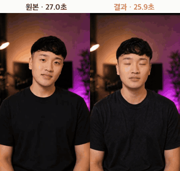
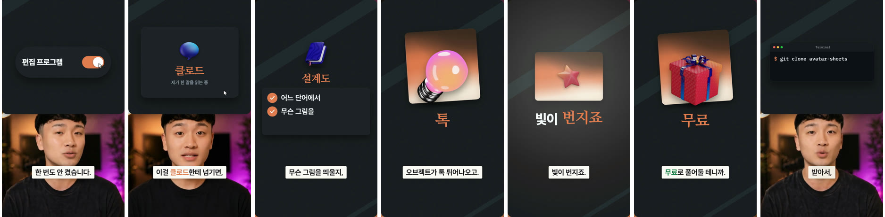
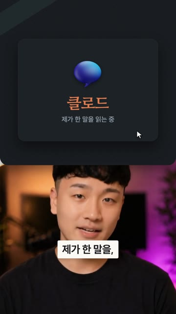
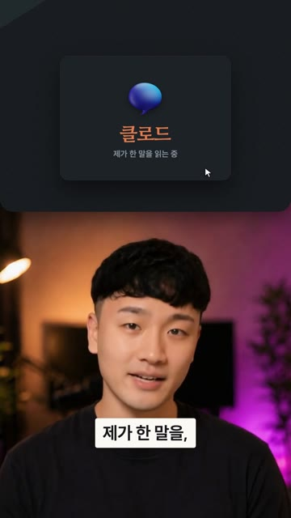
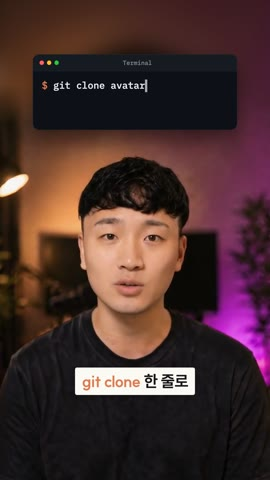
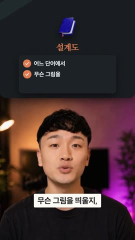
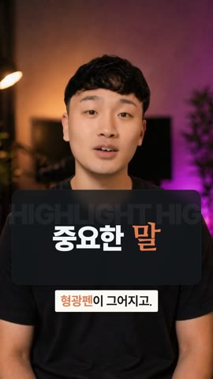
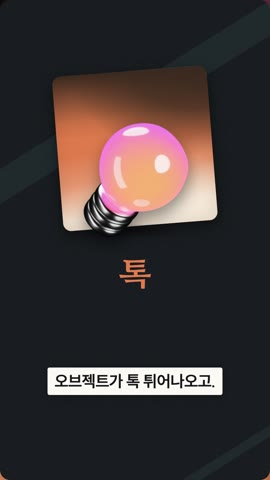
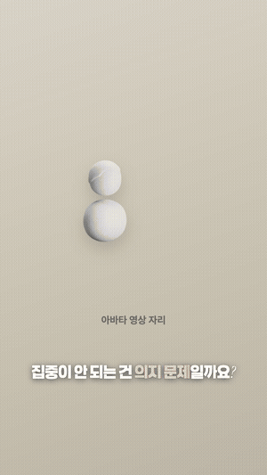
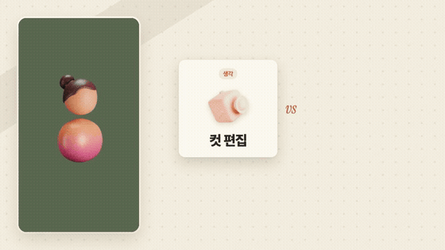

# 아바타쇼츠 (avatar-shorts)

**셀카·아바타 영상 하나를 넣으면, 무음이 정리되고 훅이 앞으로 오고, 말하는 단어에 맞춰 모션그래픽이 뜨는 쇼츠·릴스가 나옵니다.**

Claude Code 안에서 `/shorts 내영상.mp4` 한 줄이면 끝까지 알아서 만듭니다. 받아쓰기, 오탈자 교정, 무음 제거, 훅 재배치, B-roll 모션그래픽, 효과음까지 다 합니다. 편집 프로그램은 한 번도 켜지 않습니다.

<p align="center">
  
</p>
<p align="center">
  소리까지 보기: <a href="docs/example/before.mp4">원본 (27.0초)</a> · <a href="docs/example/after.mp4">결과 (25.9초)</a>
</p>

- **무료, 로컬 실행.** API 키가 필요 없습니다. 음성 인식(faster-whisper)과 렌더(Remotion)가 모두 내 컴퓨터에서 돌아갑니다.
- **얼굴을 가리지 않습니다.** 영상 내내 머리 위치(정수리~턱)를 따라가며 재고, 설명 화면을 머리 위·턱 아래·위 칸·화면 전체 중 알맞은 자리에 띄웁니다. 사람마다 앉은 높이와 얼굴 크기가 달라도 정수리가 잘리지 않습니다.
- **세로 영상**은 1080×1920 쇼츠·릴스가 됩니다. **가로 영상**은 자르지 않고, 왼쪽에 아바타 카드, 오른쪽에 PPT 같은 설명 화면을 띄웁니다.
- **묻지 않고 끝까지 만듭니다.** 무엇을 왜 정했는지는 마지막에 표 하나로 알려 주고, 마음에 안 드는 곳만 말하면 됩니다.

> 📚 **교육용으로 만든 프로젝트입니다.** Claude Code에 스킬·정책·검사를 붙여 영상 편집 같은 일을 끝까지 맡기는 방법을 보여 주려고 만들었습니다. 상용 편집 도구를 대신하려는 게 아니라, 뜯어보고 고쳐 쓰면서 배우라고 공개합니다. 만든 과정은 유튜브 [@ai.sam_hottman](https://www.youtube.com/@ai.sam_hottman) 에서 소개합니다.

---

## 빠른 시작

### 1. 준비물

| | macOS | Windows | 확인 |
|---|---|---|---|
| [Claude Code](https://claude.com/claude-code) (Claude 유료 요금제 필요) | 사이트 안내대로 | 사이트 안내대로 | `claude --version` |
| [Node.js](https://nodejs.org) 18 이상 | 사이트에서 LTS 설치 | `winget install OpenJS.NodeJS.LTS` | `node -v` |
| [Python](https://www.python.org) 3.10~3.13 | `brew install python@3.12` | `winget install Python.Python.3.12` | `python3 --version` · Windows `py --version` |
| [ffmpeg](https://ffmpeg.org) | `brew install ffmpeg` | `winget install Gyan.FFmpeg` | `ffmpeg -version` |
| [Git](https://git-scm.com) | 처음 `git` 을 치면 설치 창이 뜸 | `winget install Git.Git` | `git --version` |

Linux(Ubuntu)는 `sudo apt install ffmpeg python3-venv` 와 Node.js 면 됩니다.

> **Windows**: WSL 없이 그냥 PowerShell에서 됩니다. 위 명령은 PowerShell에 한 줄씩 붙여 넣으면 되고, 다 깔고 나면 **PowerShell 창을 닫고 새로 여세요** (그래야 새로 깐 명령을 찾습니다). Claude Code가 쓰는 Git도 여기서 함께 깔립니다. `npm` 을 쳤는데 "스크립트를 실행할 수 없습니다" 가 나오면 [문제 해결](docs/TROUBLESHOOTING.md)의 첫 표를 보세요.
>
> 명령은 운영체제와 상관없이 전부 `npm run …` 으로 같습니다. 파이썬 이름(`python3`/`py`)이나 가상환경 경로가 달라도 키트가 알아서 찾습니다.

### 2. 설치 (한 번만, 5~10분)

```bash
git clone https://github.com/hotorch/avatar-shorts.git
cd avatar-shorts
npm run setup
```

`npm run setup` 은 아래를 한 번에 받고, 마지막에 환경 진단 결과를 보여 줍니다. 전부 ✅ 면 됩니다.

| 받는 것 | 어디에 | 크기 |
|---|---|---|
| npm 패키지 (Remotion 등) | `node_modules/` | ≈450MB |
| 파이썬 가상환경: 음성 인식(faster-whisper), 얼굴 인식(OpenCV) | `.venv/` | ≈350MB |
| 음성 인식 모델 (small) | `~/.cache/huggingface` (Windows: `C:\Users\<나>\.cache\huggingface`) | ≈500MB |
| 렌더용 브라우저 | `node_modules/.remotion` | ≈100MB |

얼굴 인식 모델(YuNet, 0.3MB)은 저장소에 들어 있어서 따로 받지 않습니다.

> **예전에 설치했다면** 저장소를 받은 뒤(`git pull`) `npm run setup` 을 한 번 더 실행하세요. 머리 위치를 재는 얼굴 인식(OpenCV)이 새로 들어갔습니다. 빠져 있으면 `npm run doctor` 에 ❌ 로 나옵니다. 이미 만든 프로젝트는 `npm run face -- <이름>` 으로 머리 위치를 한 번 재면 됩니다.

```bash
npm run demo
```

영상 없이 데모 두 개를 렌더합니다. 결과는 `projects/_demo/` 에 생깁니다. 이게 잘 나오면 준비가 끝난 것입니다.

### 3. 내 영상으로 만들기

같은 폴더에서 Claude Code를 켭니다.

```bash
claude
```

그리고 이렇게 입력합니다.

```
/shorts ~/Desktop/내영상.mp4
```

Windows면 경로만 이렇게 씁니다. 파일을 탐색기에서 Claude Code 창으로 끌어다 놓아도 경로가 들어갑니다.

```
/shorts C:\Users\나\Desktop\내영상.mp4
```

대본이 있으면 다음 줄에 붙여 주세요. 자막이 훨씬 정확해집니다.

```
/shorts ~/Desktop/내영상.mp4
여러분, 쇼츠 만들 때 편집이 제일 오래 걸리죠?
사실 시간을 잡아먹는 건 컷 편집이 아니라 자막이랑 비롤입니다.
…
```

30초짜리 영상이면 보통 **10~20분** 걸립니다. 받아쓰기와 미리보기 렌더, 자체 검수가 들어 있어서 그렇습니다. 완성본은 `projects/<이름>/out/final.mp4` 에 저장됩니다.

**뭔가 안 되면** `npm run doctor` 를 먼저 실행하세요. 무엇이 빠졌고 어떻게 고치는지 알려 줍니다. 자주 막히는 곳은 [docs/TROUBLESHOOTING.md](docs/TROUBLESHOOTING.md) 에 모아 두었습니다.

---

## 좋은 결과를 얻는 영상

| | 권장 | 이유 |
|---|---|---|
| 길이 | 15~90초 | 쇼츠·릴스 길이. 길면 `"60초로 줄여줘"` 라고 하면 됩니다 |
| 언어 | 한국어 | 자막 규칙과 교정이 한국어 기준입니다 |
| 소리 | 조용한 곳, 마이크 가까이 | 무음 판정과 받아쓰기가 정확해집니다. 배경 음악이 깔린 영상은 피하세요 |
| 화면 | 정면, 머리 위에 여유가 조금 있게 | 머리 위치를 자동으로 재서 설명 화면 자리를 정합니다. 머리 위가 넉넉하면 머리 위 카드가 가장 자연스럽습니다 |
| 말 | 문장 사이에 반 박자 쉬기 | 잘라 붙일 자리가 생겨서 훅 재배치가 자연스러워집니다 |
| 파일 | mp4 · mov (아이폰 HEVC 포함) | 필요하면 자동으로 H.264로 바꿉니다. 원본 파일은 건드리지 않습니다 |

> 영상에서 **말하지 않은** 숫자·가격·결과는 화면에 만들지 않습니다. 보여 주고 싶은 숫자가 있으면 영상에서 말해 주세요.

---

## 예시: 위 영상은 이렇게 만들었습니다

```
/shorts .../Avatar v01 Final.mp4

셀카 영상, 하나.
이걸 클로드한테 넘기면, 제가 한 말을, 단어 하나하나 읽고요.
어느 단어에서, 무슨 그림을 띄울지, 설계도를 씁니다.
…
아래 repository, git clone 한 줄로 받아서, 그대로 쓰시면 됩니다.
```

<p align="center">
  
</p>

<details>
<summary>Claude가 묻지 않고 정한 것 (마지막에 받은 결정 요약)</summary>

| 항목 | 정한 것 | 이유 |
|---|---|---|
| 말 편집 | 무음 1.2초 제거, **"편집 프로그램은, 한 번도 안 켰습니다"를 첫 문장으로** | 결과+부정이라 훅 점수가 가장 높고, 떼어 놔도 뜻이 통함 |
| 색 | 다크 테크 + terracotta 3색 (자동) | AI 도구 주제라 다크 테크. 배경의 주황 램프 조명에 어울리는 3색을 영상에서 골라냄 |
| B-roll | 9장면, 얼굴만 나오는 곳은 "지금 이 화면도"·마지막 한마디뿐 | 27초짜리 짧은 기능 소개라 많이 넣음 |
| 배치 | 머리 위 3 · 분할 2 · 턱 아래 1 · 화면 전체 3 | 훅과 UI 입력(스위치·터미널)은 얼굴이 보이는 머리 위 카드, 이어지는 설명 두 문장은 한 번의 분할, 형광펜은 턱 아래 |
| 직접 만든 장면 | "빛이 번지죠" → 빛 번짐 전환, "git clone" → 터미널 | 대사가 화면을 설명하면 그 화면을 보여 줌 |
| 자막 교정 | 하나 하나→하나하나, 아래래포지토리→아래 repository | 같이 준 대본이 정답 |
| 검수에서 고친 것 | 훅 구간의 빈 판, 짧아진 장면 | 미리보기 프레임을 직접 보고 고침 |

이후 수정 요청은 한 번이었습니다: "git clone 은 검색창 말고 터미널로".
</details>

이 영상의 대본·설계도(`plan.json`)·결정 기록은 [examples/avatar-v01/](examples/avatar-v01/) 에 있습니다. 받아쓰기 없이 같은 설계도로 다시 렌더해 볼 수 있습니다.

### 얼굴을 가리지 않는 배치

B-roll을 띄울 때 먼저 **머리가 어디 있는지** 잽니다. 영상 내내 초당 4번 정수리·턱·좌우를 찾고(`scripts/face.py`, 로컬 얼굴 인식), 장면마다 그 동안 머리가 움직인 범위 전체를 비워 두고 자리를 계산합니다(`src/layouts/framing.js`).

<table>
<tr><th>예전: 얼굴 중심만 맞춤</th><th>지금: 머리 전체를 비움</th></tr>
<tr>
<td></td>
<td></td>
</tr>
</table>

예전에는 얼굴 **중심**만 화면 아래 칸에 맞췄습니다. 그래서 머리가 큰 영상은 정수리가 판 밑으로 190px 들어갔습니다. 지금은 정수리를 판 아래로 두고, 머리가 크면 판을 줄입니다. 그래도 안 되면 아바타를 조금 줄입니다.

배치는 네 가지이고, 한 영상 안에서 섞어 씁니다.

| 머리 위 `above` | 분할 `panel` | 턱 아래 `below` | 화면 전체 `cutaway` |
|---|---|---|---|
|  |  |  |  |
| 얼굴이 그대로 보여서 신뢰감을 줍니다. 훅, 제품명, 검색창·터미널 같은 UI 입력에 씁니다. 머리 위가 좁으면 아바타를 내리고 빈 곳은 흐린 영상으로 채웁니다 | UI 시연, 목록처럼 말을 이어가며 보여 줄 때 씁니다 | 핵심어 강조, 실제로 말한 숫자에 씁니다 | 개념, 비교, 전환, 큰 3D 오브젝트에 씁니다 |

어떤 배치를 고르든 판·카드·자막이 얼굴(정수리~턱)을 가리면 렌더 검사가 막습니다(정책 `face`). 분할만 쓰는 예전 방식이 좋으면 "배치는 분할이랑 전체만 써줘"라고 하면 됩니다(취향 `broll.framing: split`).

### 템플릿 데모 (`npm run demo`)

<p align="center">
  
  &nbsp;&nbsp;
  
</p>

---

## 어떻게 만드나요

| 단계 | Claude가 하는 일 |
|---|---|
| ① 영상 | 비율을 보고 머리 위치를 영상 내내 따라가며 잽니다. 주제와 배경색에 맞는 팔레트를 고릅니다 |
| ② 자막 | 받아쓰기 후 오탈자를 추론해 고칩니다 (대본이 있으면 대본이 정답) |
| ③ 말 편집 | 무음과 "음, 어"를 줄이고, 가장 센 문장을 맨 앞(훅)으로 옮깁니다. 컷마다 살짝 줌(펀치인) |
| ④ B-roll | 어느 단어에 무슨 그림을 어디(머리 위·턱 아래·분할·전체)에 띄울지 설계합니다. 템플릿에 없는 장면은 직접 만듭니다 |
| ④-1 스토리보드 | 렌더 전에 장면마다 한 장씩 뽑아 봅니다. 이웃한 장면이 배치·움직임·오브젝트까지 비슷하면 지루해서 바꿉니다 |
| ⑤ 렌더·검수 | 미리보기 프레임을 직접 보고 고친 뒤 최종본을 만듭니다 |

### 고치고 싶으면 이렇게 말해 보세요

- "3번 장면은 얼굴로 두고, 대신 마지막에 결론 카드 넣어줘"
- "그 검색창은 머리 위에 띄워줘" / "숫자는 턱 아래에 보여줘"
- "자막을 조금 더 크게 해줘" / "강조색을 파랑으로 바꿔줘"
- "B-roll을 더 많이 넣어줘"
- "무음 덜 잘라줘" / "원래 순서 그대로 해줘" / "45초로 줄여줘"
- "이 부분은 AI 채팅 화면처럼 보여줘"
- "이 레퍼런스 그라디언트를 우리 정책으로 넣어줘"
- "구글 플로우로 비롤을 직접 만들고 싶어. 프롬프트 줘"
- "렌더 전에 스토리보드 먼저 보여줘"
- "이 영상처럼 만들고 싶어" (좋아하는 영상 파일과 함께) / "내 취향 보여줘"
- "하나씩 물어보면서 해줘" (질문 정도를 바꿉니다)

한 번 고친 취향은 그 프로젝트에 기억하고, 같은 방향으로 두 번 고치면 다음 영상부터 내 기본값이 됩니다.

### 내 취향 배우기 (`style/me.json`)
좋아하는 쇼츠 영상 파일을 주면서 "이 영상처럼 만들고 싶어"라고 하세요. Claude가 화면이 바뀌는 리듬, 말 사이 쉼, 밝기를 재고, 장면을 직접 보고 자막 크기와 배치를 정해 **내 취향**으로 기억합니다. 영상을 줄수록 정확해집니다. 내 취향은 내 PC에만 있고 git에 올라가지 않습니다. "내 취향 보여줘"라고 하면 지금까지 배운 것을 보여 줍니다. 그림·글자·로고는 가져오지 않고 구도와 리듬만 배웁니다.

### 정책과 취향 (`style/`)
- **정책** `style/policy.json`: 어기면 틀린 것입니다. 지어내지 않기, 첫 1초는 얼굴, 얼굴(정수리~턱)을 가리지 않기, 이웃한 장면이 비슷하지 않기, 자막 길이, 그라디언트 레시피, 승인된 3색 팔레트 같은 것들이고, 렌더 검사가 막습니다. 팀·채널이 git으로 공유합니다.
- **취향** `style/taste.json`: 고르는 것입니다. 팔레트, 무음을 얼마나 줄일지, 훅을 앞으로 뺄지, B-roll 양, 자막 크기, 질문 정도(`ask`). Claude는 이 값을 보고 묻지 않고 정합니다. 공용 기본값이고, 내 값은 `style/me.json` 이 덮어씁니다.
- 레퍼런스(이미지·가이드 문서)를 주면서 "반영해줘"라고 하면 Claude가 정책·취향·부품으로 나눠 넣습니다. 기준은 [style/README.md](style/README.md) 에 있습니다.

---

## 들어 있는 것

| | |
|---|---|
| **템플릿 12종** | hero(3D 오브젝트와 핵심어), keyword(큰 타이포와 손그림 마커), stat, compare, steps, list, chart, quote(종이 콜라주), chapter, **morph**(도형 하나가 알약 → 카드 → 채팅 → 터미널로 연속 변신), media(직접 만든 이미지·영상), palette(3색 팔레트 카드) |
| **말 편집** | 무음·군더더기 제거, 훅 재배치, 펀치인 줌 (`scripts/edit.py`) |
| **배치 4가지** | 머리 위 카드, 턱 아래 카드, 분할, 화면 전체. 머리 위치를 재서 자리를 계산 (`scripts/face.py`, `src/layouts/framing.js`) |
| **팔레트 3종 + 승인된 3색 15벌** | 에디토리얼(미색 종이와 보라) · 다크 테크(차콜과 청록) · 아카데믹(크림과 테라코타). 영상 배경색에 맞춰 3색을 자동으로 고름 |
| **3D 오브젝트 62종** | 전구, 체스, 시계, 로켓, 자물쇠, 돈, 채팅 등 (CC0) |
| **글꼴 6종** | Pretendard, SUIT, 나눔명조, 학교안심 알림장, Instrument Serif, IBM Plex Mono (OFL) |
| **효과음 11종** | 코드로 합성했습니다(whoosh, pop, click, tick, thud, paper, sparkle 등). 저작권 걱정이 없습니다 |
| **스킬 9개** | `shorts`(전체 흐름) · `transcribe-ko` · `viral-edit` · `broll-plan` · `storyboard` · `motion-kit` · `style-intake` · `reference-taste` · `flow-prompts` |

```
.claude/skills/   Claude가 따르는 작업 방법 (스킬 9개)
style/            정책(policy.json)과 취향(taste.json · 내 취향 me.json 은 git 제외)
src/              Remotion 코드: 레이아웃, 템플릿, 부품(kit), 자막
scripts/          영상 분석, 머리 추적, 음성 인식, 자막 정렬, 말 편집, 렌더, 검수, 효과음 합성
public/           글꼴, 3D 오브젝트, 효과음
models/           얼굴 인식 모델 (YuNet)
examples/demo/    데모 계획서 (plan.json 예시)
projects/         내 작업 폴더 (git에 올라가지 않음)
```

### 직접 만져보기
- `npm run studio`: 브라우저에서 데모 영상을 프레임 단위로 봅니다.
- `examples/demo/vertical.json` 을 고치고 `npm run demo` 를 다시 실행하면 결과가 바로 바뀝니다.
- 새 장면은 `src/custom/OrbitIdea.tsx` 를 복사해서 시작하세요.

---

## 자주 묻는 것

- **`/shorts` 가 안 보여요.** Claude Code를 이 폴더(`avatar-shorts`)에서 **새로** 켜야 스킬이 잡힙니다. 다른 폴더에서 켰거나 clone 전에 켠 창이면 닫고 `cd avatar-shorts && claude`.
- **명령마다 허용할지 물어봐요.** 이 키트가 쓰는 명령(`npm run …`, `scripts/` 실행, ffmpeg, remotion)과 `projects/` 안의 파일 수정은 [.claude/settings.json](.claude/settings.json) 에 미리 허용해 두었습니다. 그 밖의 명령만 물어봅니다. 허용 범위가 걱정되면 이 파일을 먼저 읽어 보세요.
- **돈이 드나요?** 이 키트와 음성 인식은 무료입니다. Claude Code를 쓰려면 Claude 유료 요금제가 필요합니다.
- **자막 인식이 부정확해요.** 대본을 같이 주는 게 가장 확실합니다. 대본이 없으면 "medium 모델로 다시 받아써줘"라고 하세요. 느리지만 더 정확합니다. 고유명사는 처음에 알려 주면 인식률이 올라갑니다.
- **렌더가 느려요.** 최종본은 1분 영상 기준 보통 1~3분입니다. Claude는 검수할 때 절반 해상도 미리보기를 먼저 씁니다.
- **처음 실행이 멈춘 것 같아요.** 첫 받아쓰기와 첫 렌더는 모델·브라우저를 받느라 몇 분 걸립니다. `npm run setup` 을 했다면 이미 받아져 있습니다.
- **원본 영상이 바뀌나요?** 아니요. `projects/<이름>/input.mp4` 로 복사해서 그것만 씁니다.
- **영어 영상도 되나요?** 받아쓰기는 되지만 자막 규칙과 교정이 한국어 기준이라 결과가 어색할 수 있습니다.
- **그 밖의 문제**는 [docs/TROUBLESHOOTING.md](docs/TROUBLESHOOTING.md) 를 보고, 그래도 안 되면 이슈에 `npm run doctor` 출력을 붙여 주세요.

## 기여하기

- 코드를 고쳤으면 `npm test` 를 돌려 주세요 (1분 안쪽, 음성 인식·전체 렌더 없음). PR에서도 같은 시험이 돕니다.
- 버그를 고쳤으면 `scripts/selftest.mjs` 에 그 버그를 잡는 시험을 한 줄, `CLAUDE.md` 의 "실제로 겪은 함정"에 한 줄 추가해 주세요.
- 새 규칙은 먼저 정책인지 취향인지 가려 주세요 ([style/README.md](style/README.md)). 정책은 검사로 막고, 취향은 기본값으로 둡니다.
- 새 템플릿은 `src/scenes/index.tsx` · `scripts/render.mjs` · `.claude/skills/broll-plan/references/templates.md` 세 곳에 넣습니다 (어긋나면 시험이 알려 줍니다).

## 라이선스와 출처

- 코드: MIT. 자유롭게 쓰고, 고치고, 팔아도 됩니다. 복사본에 `LICENSE` 파일만 남겨 주세요.
- **출처 표시 부탁:** 이 키트를 쓰거나 응용해서 영상·강의·글·저장소를 만들면 아래처럼 출처를 적어 주세요. 의무는 아니지만 큰 힘이 됩니다.
  ```
  avatar-shorts by @ai.sam_hottman (YouTube) · hotorch (GitHub)
  https://github.com/hotorch/avatar-shorts
  ```
- 글꼴: SIL Open Font License (`public/fonts/*-OFL.txt`)
- 3D 오브젝트: CC0 (`public/objects/LICENSE`)
- 얼굴 인식 모델 [YuNet](https://github.com/opencv/opencv_zoo/tree/main/models/face_detection_yunet): MIT (`models/yunet/LICENSE`)
- 렌더 엔진 [Remotion](https://remotion.dev)은 개인과 직원 3명 이하 회사는 무료입니다. 그보다 큰 회사는 [Remotion 회사 라이선스](https://remotion.pro)가 필요합니다.
